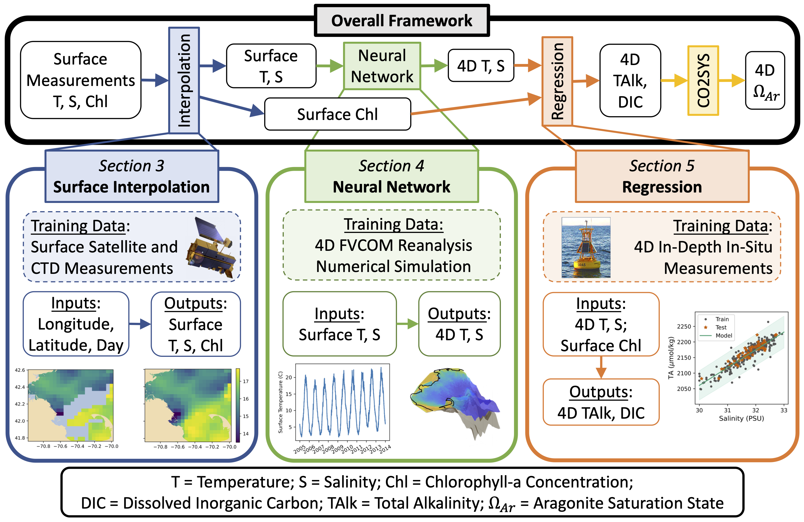

# aragonite-opendap

This repository implements the framework described in *Data-Driven Modeling of 4D Ocean and Coastal Acidification from Surface Measurements* to serve 4D aragonite predictions using OPeNDAP.

	

