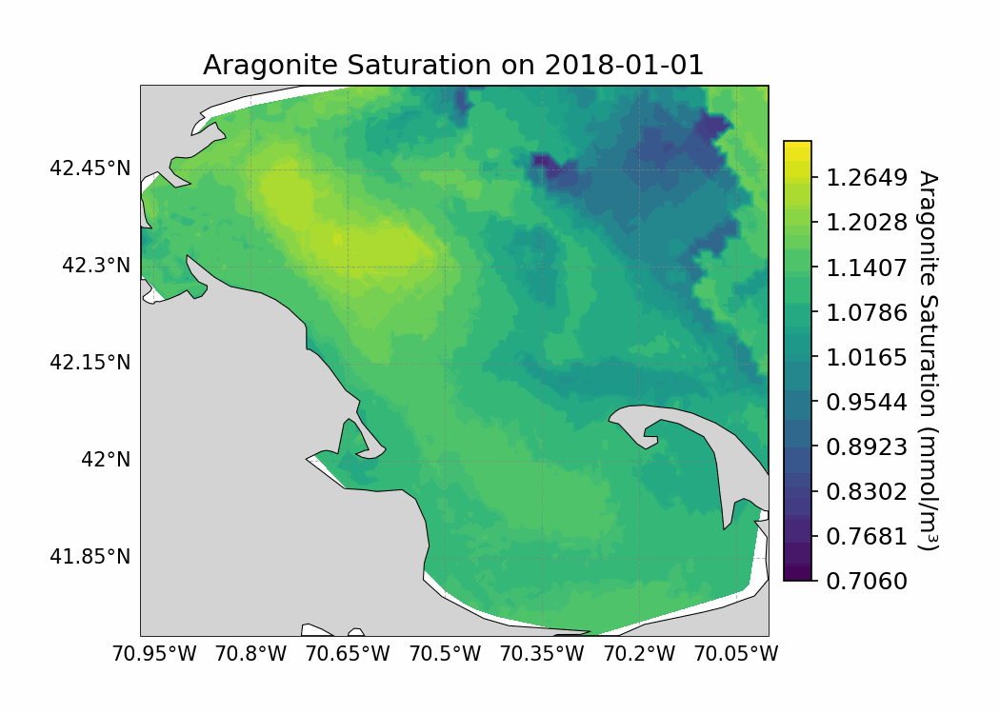

# aragonite-opendap
[](https://opensource.org/licenses/MIT)
[](https://www.python.org/downloads/release/python-380/)

## Overview

This repository implements the framework described in *Data-Driven Modeling of 4D Ocean and Coastal Acidification from Surface Measurements* to predict Aragonite Saturation State ($\Omega_{\text{Ar}}$) fields for Massachusetts Bay. Satellite data sources are accessed dynamically via [PODAAC](https://podaac.jpl.nasa.gov/), enabling up-to-date, daily predictions. The predictions are served over an [OPeNDAP](https://www.earthdata.nasa.gov/engage/open-data-services-and-software/api/opendap) protocol, allowing for easy integration with existing tools and services.

<p align="center">
	
</p>

## Setup 

### Install from source:
1. **Clone the repository and move into its directory:**

```bash
git clone https://github.com/becklabs/aragonite-opendap.git && cd aragonite-opendap
```

2. **From this directory, install the `oadap` pip package in editable mode:**

```
pip install -e .
```

### Configure Earthdata Credentials: 
1. **Create an Earthdata Login:**
To access satellite datasources, you will need to create an [Earthdata Login](https://urs.earthdata.nasa.gov/).

2. **Set Environment Variables**: After creating an account, set the following environment variables:

```bash
export EARTHDATA_USERNAME=<your_username>
export EARTHDATA_PASSWORD=<your_password>
```

3. **Alternative Option: Add Credentials to `.netrc`:** Instead of setting environment variables, you can add the following lines to your `~/.netrc` file:
```
machine urs.earthdata.nasa.gov
    login <your_username>
    password <your_password>
```

### Download Data Artifacts:
To run framework training and inference, you will need to download the provided static, preprocessed data artifacts:

1. **Download the `data_artifacts.zip` file (~500MB) from the [Google Drive Link](https://drive.google.com/file/d/1w9pq5Gfqottebf14BIf7gaBQy7mpHlKR/view?usp=sharing).**
2. **Extract the contents of `data_artifacts.zip` to the `data/` directory at the root of the repository:**
   
   ```bash
   unzip /path/to/data_artifacts.zip -d data/
   ```

The `data_artifacts.zip` includes preprocessed data and artifacts from FVCOM, MWRA, and Earthdata sources.

### Additional Setup (Training Only)
You will need a [Weights and Biases](https://wandb.ai/site) account to track training runs.

**Login into Weights and Biases:**
    
```bash
wandb login
```


## Inference
To make daily $\Omega_{\text{Ar}}$ predictions across a given date range, run the `scripts/run_framework.py` script:

```
python -m scripts.run_framework \
    --start         [Required] [str]  Start date in YYYY-MM-DD format \
    --end           [Required] [str]  End date in YYYY-MM-DD format \
    --cache_dir     [Optional] [str]  Cache directory for joblib memory (default: intermediate_cache/) \
    --output_nc     [Optional] [str]  Output NetCDF file path (default: aragonite_field.nc)
```

**Example:**

```bash
python -m scripts.run_framework \
    --start 2018-01-01 \
    --end 2018-01-31 \
    --output_nc data/aragonite_field_jan2018.nc
```

The `aragonite_field_jan2018.nc` file will contain the predicted $\Omega_{\text{Ar}}$ field for each day in January 2018 and is  visualized in the animation below:

<p align="center">
	
</p>


## Training

### Temperature/Salinity TCN
To train the Temporal Convolutional Network (TCN) to predict time-varying PCA coefficients for temperature and salinity:

1. **Update `config/v0.yaml` to point to the correct training dataset:**

For **Temperature**:

```yaml
  train_file: "FVCOM/preprocessed/temperature/all/train/X.npy"
  label_file: "FVCOM/preprocessed/temperature/all/train/y.npy"
```

For **Salinity**:

```yaml
  train_file: "FVCOM/preprocessed/salinity/all/train/X.npy"
  label_file: "FVCOM/preprocessed/salinity/all/train/y.npy"
```

2. **Run the `scripts/tcn/train.py` script:**

```
python -m scripts.tcn.train \
    --config_file   [Optional] [str]  Path to the configuration file (default: config/v0.yaml) \
```

**Example:**

```bash
python -m scripts.tcn.train --config_file config/v0.yaml
```


#### Total Alkalinity (TAlk) Regression
To fit the Bayesian Ridge Regression for TAlk, run the `scripts/regression/fit_talk.py` script:

```
python -m scripts.regression.fit_talk \
    --csv_file      [Optional] [str]  Path to the raw MWRA CSV file (default: data/MWRA/MWRA.csv) \
    --checkpoint_path [Optional] [str]  Path to save the model checkpoint (default: checkpoints/TAlk_regression/model.pkl)
```

**Example:**

```bash
python -m scripts.regression.fit_talk \
    --csv_file data/MWRA/MWRA.csv \
    --checkpoint_path checkpoints/TAlk_regression/model.pkl
```

#### Dissolved Inorganic Carbon (DIC) Regression
To fit the Gaussian Process Regression for DIC, run the `scripts/regression/fit_dic.py` script:

```bash
python -m scripts.regression.fit_dic \
    --csv_file data/MWRA/MWRA.csv \
    --checkpoint_path checkpoints/DIC_regression/model.pkl
```

**Example:**

```bash
python -m scripts.regression.fit_dic \
    --csv_file data/MWRA/MWRA.csv \
    --checkpoint_path checkpoints/DIC_regression/model.pkl
```